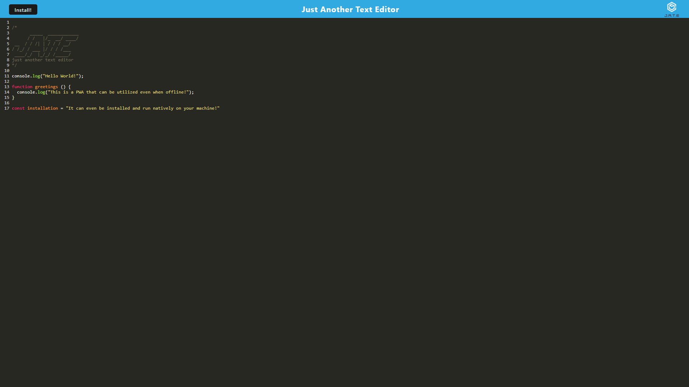

# Text Editor

 

## Description

- This application (JATE) is a simple text editor that will highlight JavaScript syntax. It is an example of a progressive web application (PWA), meaning it will function regardless of internet access (as long as the page has been visited once online), and can even be downloaded and run natively on your machine. 
- This application features the utlization of a service worker to control the page, data caches to speed up page loading and provide offline functionality, indexedDB and localStorage for client data storage and redundancy, as well as the ability to install the application locally.
- PWAs are incredibly useful and powerful, but they are tricky to learn especially for a new programmer. My motivation behind this project was to delve into the technologies and syntax required to develop an application that meets all the criteria of a PWA.

## Table of Contents

1. [Installation](#installation)
2. [Usage](#usage)
3. [Demonstration](#demonstration)
4. [License](#license)
5. [How to Contribute](#how-to-contribute)
6. [Questions?](#questions)

## Installation

**This application is deployed to Heroku, and you can access it [here](https://hidden-garden-70772.herokuapp.com/).**

Alternatively, you can clone this repo. 

If performing a manual installation, you need [Node.js](https://nodejs.org/en/).

To install dependencies, open in [Visual Studio Code](https://code.visualstudio.com/), and in the terminal run: 

      npm install 

## Usage

**This application is deployed to Heroku, and you can access it [here](https://hidden-garden-70772.herokuapp.com/).**

Alternatively, once the application is installed and opened in Visual Studio Code, or navigated to using Git Bash (or similar command-line tool), run: 

      npm start 

The application is written to run on port 3000, but you can change the port number by altering it in the `server/server.js` file.

Once the server has been started, in your browser, navigate to http://localhost:3000

##  Demonstration

**This application is deployed to Heroku, and you can access it [here](https://hidden-garden-70772.herokuapp.com/).**

A screenshot:

## License

This application is covered under the [MIT](https://opensource.org/licenses/MIT) license

----------------------------------------------------------------

  Copyright © 2022 Richard Zhang

  Permission is hereby granted, free of charge, to any person obtaining a copy of this software and associated documentation files (the "Software"), to deal in the Software without restriction, including without limitation the rights to use, copy, modify, merge, publish, distribute, sublicense, and/or sell copies of the Software, and to permit persons to whom the Software is furnished to do so, subject to the following conditions:
  
  The above copyright notice and this permission notice shall be included in all copies or substantial portions of the Software.
  
  THE SOFTWARE IS PROVIDED "AS IS", WITHOUT WARRANTY OF ANY KIND, EXPRESS OR IMPLIED, INCLUDING BUT NOT LIMITED TO THE WARRANTIES OF MERCHANTABILITY, FITNESS FOR A PARTICULAR PURPOSE AND NONINFRINGEMENT. IN NO EVENT SHALL THE AUTHORS OR COPYRIGHT HOLDERS BE LIABLE FOR ANY CLAIM, DAMAGES OR OTHER LIABILITY, WHETHER IN AN ACTION OF CONTRACT, TORT OR OTHERWISE, ARISING FROM, OUT OF OR IN CONNECTION WITH THE SOFTWARE OR THE USE OR OTHER DEALINGS IN THE SOFTWARE.

  ----------------------------------------------------------------

## How to Contribute

If you want to contribute to this project and make it better, your help is very welcome. This was a school project, so anything you want to do to it, go for it. You can also contact me directly through the links below.

## Questions?

Have any questions? Here is a list of my links:
- GitHub: [RichardZhang01](https://github.com/RichardZhang01)
- Email: richardzhiyuanzhang@gmail.com

